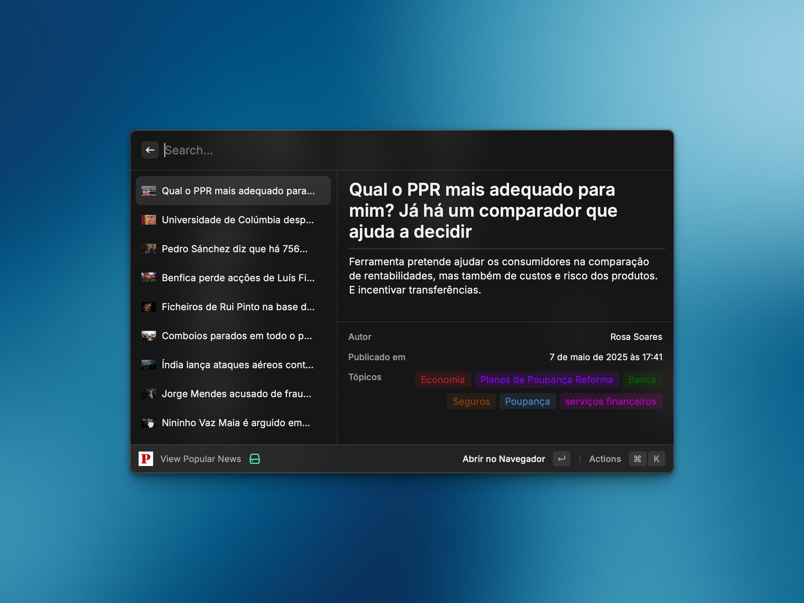

# 📰 Raycast Público


Browse, search, and read the latest news from [Público](https://www.publico.pt/) directly from your command bar.



## ✨ Features
- Browse the latest headlines from Público
- Curated view of the most popular stories
- Search articles by keyword
- Read article previews without leaving Raycast
- Quick actions to open, copy, or share article links

## 🧭 Commands
| Command | Description |
| --- | --- |
| `View Latest News` | Browse the latest headlines from Público |
| `View Popular News` | Browse the most popular stories from Público |
| `Search News` | Search for articles on Público |

## 🚀 Getting Started
```bash
git clone https://github.com/caasols/raycast-publico.git
cd raycast-publico
npm install
npm run dev
```

## 🤝 Contributing
Issues and pull requests are welcome! Please open a discussion if you plan to work on a larger change so we can align on the approach.

## ⭐ Support
If this extension saves you time:
- Star the [GitHub repository](https://github.com/caasols/raycast-publico)
- Share it with coworkers who live in their command bar
- Report bugs or enhancements via GitHub issues

## 📄 License
Released under the [MIT License](./LICENSE).
