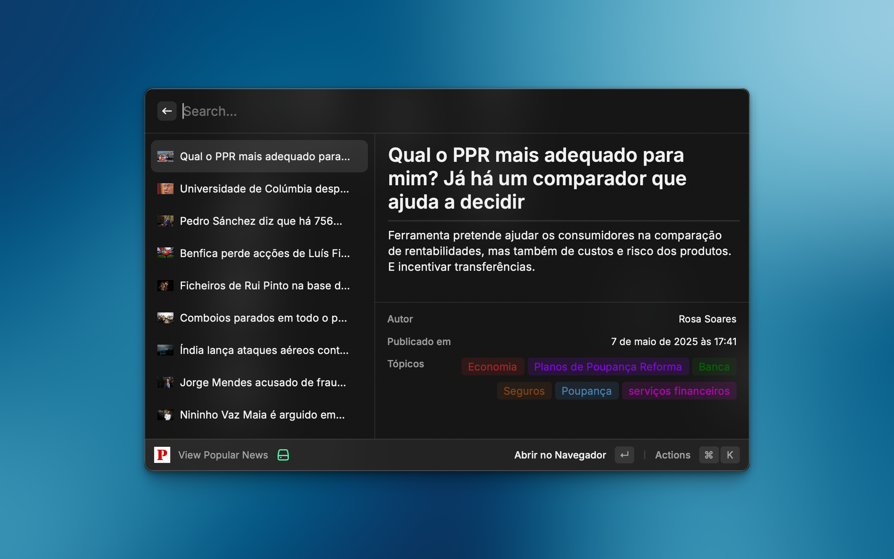

# Público for Raycast


Browse the latest headlines, jump straight into a section, search by topic, and read articles from [Público](https://www.publico.pt/) directly from your command bar.



Público is a Portuguese daily newspaper. This extension talks to Público's public JSON API (`https://www.publico.pt/api`) and needs no account, key, or binary installed: the two feed commands, the 34 section commands, and search all read the same set of open list endpoints. Reading an article renders whatever the API returns for it inside Raycast, and Open in Browser is always one keystroke away for the rest.

## Features

- Browse the latest headlines and the day's most popular stories
- Jump straight to any of 34 Público sections, each as its own root command
- Search by topic, person, place, or team, and get the articles filed under it
- Read an article inside Raycast, with author, publication date, and topic tags in the detail pane
- Copy an article's URL or title, or open it in your browser, without leaving the list
- Match section commands in English too: typing `sports` finds Desporto, `health` finds Saúde

## Commands

| Command             | Description                                                                                       |
| ------------------- | ------------------------------------------------------------------------------------------------- |
| `View Latest News`  | The latest headlines from Público, newest first                                                   |
| `View Popular News` | The stories Público is currently featuring                                                        |
| `Search News`       | Search by topic, person, place, or team, for example `Benfica`, `Trump`, `inteligência artificial` |
| One per section     | 34 commands, one for each Público section, listed below                                           |

Every list behaves the same way. Select a story to see its summary, author, publication date, and topics in the detail pane, then use one of these actions:

| Action            | Shortcut       | What it does                                     |
| ----------------- | -------------- | ------------------------------------------------ |
| `Read Article`    | `Enter`        | Opens the article inside Raycast                 |
| `Open in Browser` |                | Opens the article on publico.pt                  |
| `Copy URL`        | `Cmd C`        | Copies the article link                          |
| `Copy Title`      | `Cmd Shift C`  | Copies the article headline                      |
| `Refresh`         | `Cmd R`        | Refetches the current feed                       |

### Sections

Each section is its own root command, so you can bind Política or Desporto to an alias or a hotkey and skip the extension menu entirely.

| Group                | Commands                                                                |
| -------------------- | ----------------------------------------------------------------------- |
| News and politics    | Política, Parlamento, Mundo, Europa, Brasil, Economia, Sociedade, Local, Lisboa, Porto |
| Knowledge and health | Ciência, Tecnologia, Educação, Saúde, Media                             |
| Environment          | Ambiente, Azul, Ecosfera                                                |
| Culture and life     | Cultura, Ípsilon, Opinião, Desporto, Gente, Ímpar, P3                   |
| Travel and living    | Fugas, Viagens, Gastronomia, Casa, Automóveis                           |
| Multimedia           | Multimédia, Vídeos, Podcasts, Fotogaleria                               |

The list lives in `src/sections.json`. To add or remove one, edit that file and run `npm run generate:sections`, which rewrites both the command components and the `commands` block in `package.json`.

## Preferences

Nothing is required to start using the extension. There is a single optional preference.

| Preference     | Value                                                                  |
| -------------- | ---------------------------------------------------------------------- |
| `Max Articles` | How many articles a list shows at most: `10`, `25` (default), or `50`. |

## How search works

Público's `/pesquisa` page is behind a bot wall, and the API's own search route ignores its query parameter, so `Search News` searches by topic instead. Your query is slugified (lowercase, accents stripped, spaces turned into hyphens, so `Donald Trump` becomes `donald-trump`) and requested as a Público topic feed. If nothing matches, the query is retried with Portuguese stopwords removed, so `guerra na Ucrânia` also tries `guerra-ucrania`.

This is fast and accurate for subjects, people, places, and teams, which is what most searches are. It does not do free-text matching: a phrase that is not a Público topic returns no results rather than a fuzzy list.

## Requirements and limits

The extension is read-only and anonymous. It sends no credentials, has no telemetry, and contacts no host other than `publico.pt`.

- Público's list endpoints return about 10 articles each and ignore paging parameters, so `Max Articles` is an upper bound rather than a target. Setting it to 50 will not produce more than the API serves.
- Search matches Público topics, not arbitrary text. See the section above.
- `Read Article` renders what the API returns for that article. When the response carries no body, the reader says so and points you to Open in Browser.
- The `Summarize` action is a placeholder: it currently shows a "coming soon" toast and does not summarize anything yet.

## Getting Started

### Raycast Store

Install directly from the [Raycast Store](https://www.raycast.com/caasols/publico).

### Manual

```bash
git clone https://github.com/caasols/raycast-publico.git
cd raycast-publico
npm install && npm run dev
```

### Development

Other useful scripts:

```bash
npm test                     # unit tests
npm run test:watch           # the same, in watch mode
npm run lint
npm run build
```

Two maintainer scripts keep the extension in sync with Público's API:

```bash
npm run discover             # probe the API and write a local endpoint report under docs/
npm run generate:sections    # regenerate the section commands from src/sections.json
```

Run `npm run discover` first when a section stops returning articles or you want to add a new one: it reports which slugs work and how many items each returns, so you can confirm a slug before wiring a command to it.

## Contributing

Issues and pull requests are welcome. Please open a discussion if you plan to work on a larger change so we can align on the approach.

## Support

If this extension saves you time:

- Star the [GitHub repository](https://github.com/caasols/raycast-publico)
- Share it with coworkers who live in their command bar
- Report bugs or enhancements via GitHub issues

## License

Released under the [MIT License](./LICENSE).
